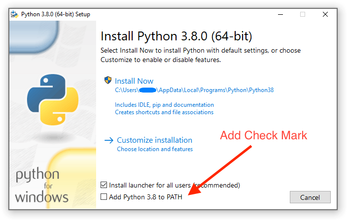

# Install

## Mac

The easiest way is using Brew.  Head over to [https://brew.sh/](https://brew.sh/) and follow the instructions to install.  After you have finished installing come back to these docs and run the following commands in your terminal.  If you run into any errors while running these commands, restart your terminal.

```bash
$ brew install python3
$ python3
>>> 2+2
4
>>> exit()
$ 
```

Congratulations, you have successfully installed Python3 on your Mac.


Once you get a good handle on python I would recommend looking into pyenv.  [Learn More](https://github.com/pyenv/pyenv)


## PC

You will want to head over to [https://www.python.org/downloads/](https://www.python.org/downloads/) and download the latest stable version.


Add Python to the PATH during installation on the first screen.  If you forget to do this you will need to manually add it.  See the image below.




Run the following commands in your Command Prompt to make sure everything was installed correctly.  If you run into any errors, try restarting your Command Prompt

```bash
$ python
>>> 2+2
4
>>> exit()
$ 
```

Congratulations, you have successfully installed Python3 on your PC.

