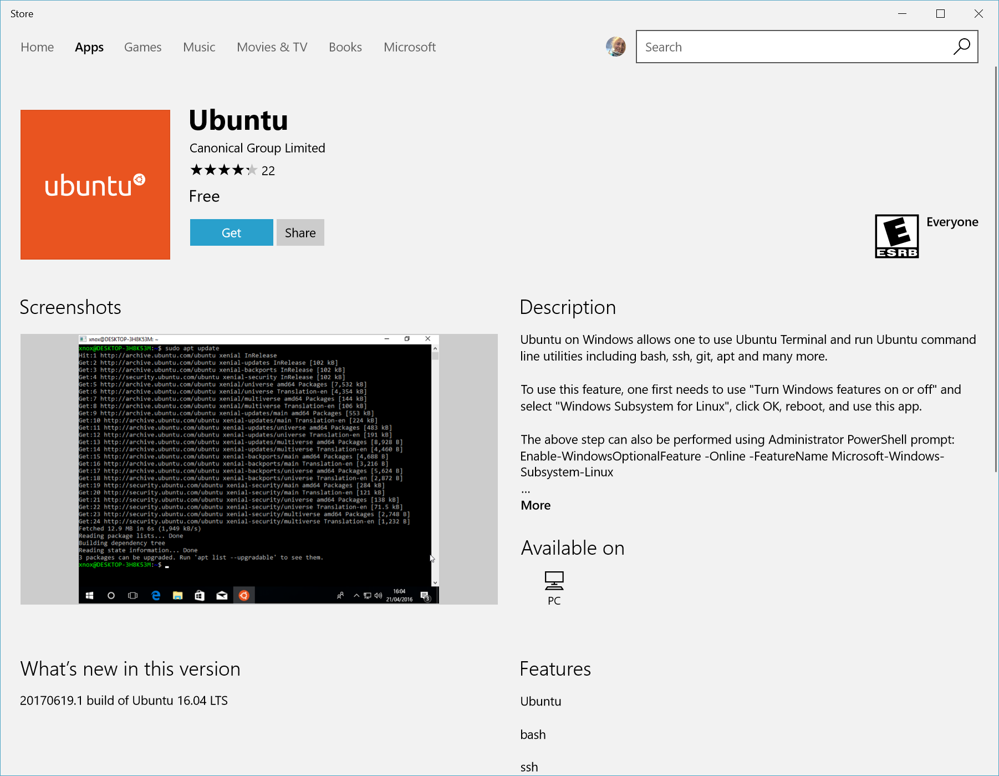

# Install

## Mac

Install Redis via Brew.


Need to install brew?  [Learn more](https://brew.sh/)


```
$ brew install redis
```

Turn on your Redis server.

```bash
$ redis-server
```

Open a new terminal to enter the Redis-cli.

```bash
$ redis-cli
127.0.0.1:6379> 
```

Execute a simple Redis command to verify your Redis server is running and available.

```bash
127.0.0.1:6379> set user:1 "Jane"
127.0.0.1:6379> get user:1
127.0.0.1:6379> exit
```

**CONGRATULATIONS! You've successfully installed and set up a Redis server.**

## Windows

Redis doesn't play nice with windows. You will want to install Windows Subsystem for Linux \(wsl\) for the best experience. Please follow the steps below to get WSL, Ubuntu, and Redis installed on your system.


If you don't want to bother using wsl, you can use the following [redis msi](https://github.com/microsoftarchive/redis/releases/tag/win-3.0.504).  I would highly recommend using wsl though as it is very easy to setup. 



Most of this information come from the microsoft docs.  I took out the steps on how to update wsl to wsl2 as it requires the user to get into their bios settings.  If you would like to use wsl2 you can follow the Microsoft docs instead.   [Learn More](https://docs.microsoft.com/en-us/windows/wsl/install-win10)


### Step 1 - Enable the Windows Subsystem for Linux <a id="step-1---enable-the-windows-subsystem-for-linux"></a>

Open PowerShell as Administrator and run:

```bash
dism.exe /online /enable-feature /featurename:Microsoft-Windows-Subsystem-Linux /all /norestart
```


RESTART YOUR COMPUTER AFTER THE INSTALL IS DONE.


### Step 2- Install your Linux distribution of choice

1. Open the Microsoft Store and search for Ubuntu.
2. From the Ubuntu page, select "Get".
   1. You might get asked to install, go ahead and click install if it asks.
   2. You will need to click launch after it downloads and installs.




The first time you launch a newly installed Linux distribution, a console window will open and you'll be asked to wait for a minute or two for files to de-compress and be stored on your PC. All future launches should take less than a second.


### Step 3 - Create a user account and password


When you type your password, you won't see any text but it is typing.  Luckily they have a verified password to make sure you typed it correctly.



### Step 4 - Setup and test Redis


Run the following commands in your new ubuntu terminal.


First, make sure to get all the latest updates, upgrade, and install the Redis-server.  Then check what version was installed.

```bash
$ sudo apt-get update
$ sudo apt-get upgrade
$ sudo apt-get install redis-server
$ redis-cli -v
```

Restart the Redis server to make sure it is running.

```bash
$ sudo service redis-server restart
```

Execute a simple Redis command to verify your Redis server is running and available.

```bash
$ redis-cli
127.0.0.1:6379> set user:1 "Jane"
127.0.0.1:6379> get user:1
127.0.0.1:6379> exit
```

Stopping your Redis server.

```bash
$ sudo service redis-server stop
```

**CONGRATULATIONS! You've successfully installed and set up a Linux distribution with a Redis server that is completely integrated with your Windows operating system!**

